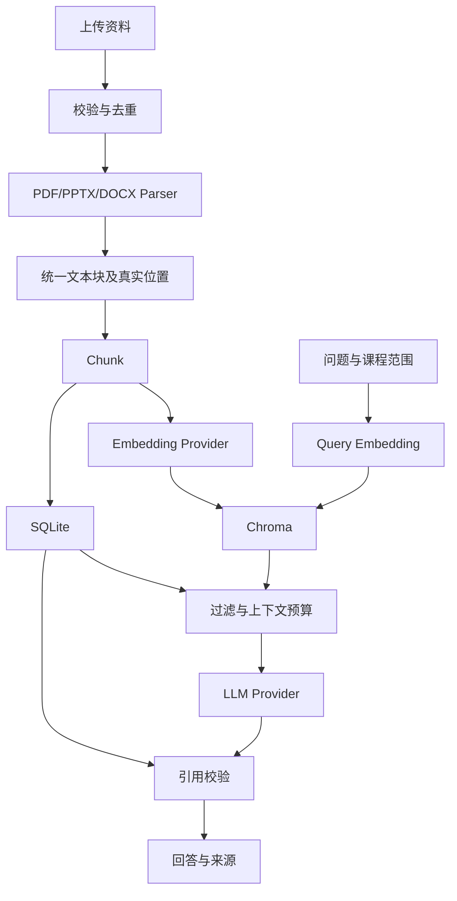

# Phase 1 架构

## 范围

单机、单用户、一个 Uvicorn worker。SQLite 是权威资料与来源存储，Chroma 是可重建索引。本阶段不引入任务队列、Agent 框架或知识图谱。

## 数据流

来源页码属于数据库事实。PDF 使用从 1 开始的物理页码，PPTX 使用从 1 开始的幻灯片序号，DOCX 无可靠排版页码，使用标题和段落/表格索引。不能用 LLM 猜测缺失章节。

## 状态一致性

文档先保存为 `processing`，解析、Embedding 和写索引均成功后才设为 `ready`。失败设为 `failed`，可重试。启动发现遗留 `processing` 时标记失败，因为上一次处理可能被中断。检索只接受当前 Embedding 配置匹配且状态为 `ready` 的文档。

SQLite 与 Chroma 不能一起提交事务，因此以状态限制可见性：重试前清除旧向量和 Chunk；稳定 Chunk ID 使用文档 ID 加序号生成；失败的向量清理即使再次失败，也不会让失败文档进入问答上下文。Embedding 配置指纹包括模式、模型、维度、服务地址，改配置后资料需要重建。

MVP 上传接口在工作线程中同步处理并返回最终结果，避免添加不持久化的后台队列。处理期间列表可显示 `processing`。同一进程限制一个导入任务；服务退出中断后由状态恢复处理。后续大型资料和多用户需求应引入持久化任务队列。

## 上下文预算

Chunk 使用字符预算便于中文初学者理解；模型上下文限制另行考虑。初版以最多 9000 字符资料、有限问题长度和输出上限控制输入规模，但不声称精确 Token 计数。配置服务必须支持该输入大小，服务返回上下文错误时明确报错，调低预算后重试。

## 来源展示与内容可信度

模型返回结构化的 `answer`、`citation_ids` 与 `insufficient_evidence`。服务只接受本次上下文中的来源 ID，并从数据库恢复页码与文档名称。来源卡片是权威定位；自然语言回答仍可能含错误，因此 Prompt 禁止生成页码，人工评估检查回答与原文支持关系。

参考：[FastAPI 上传](https://fastapi.tiangolo.com/tutorial/request-files/)、[Chroma 查询](https://docs.trychroma.com/docs/querying-collections/query-and-get)、[Chroma cosine 配置](https://docs.trychroma.com/docs/collections/configure)、[python-docx 顺序读取](https://python-docx.readthedocs.io/en/stable/_modules/docx/document.html)。
